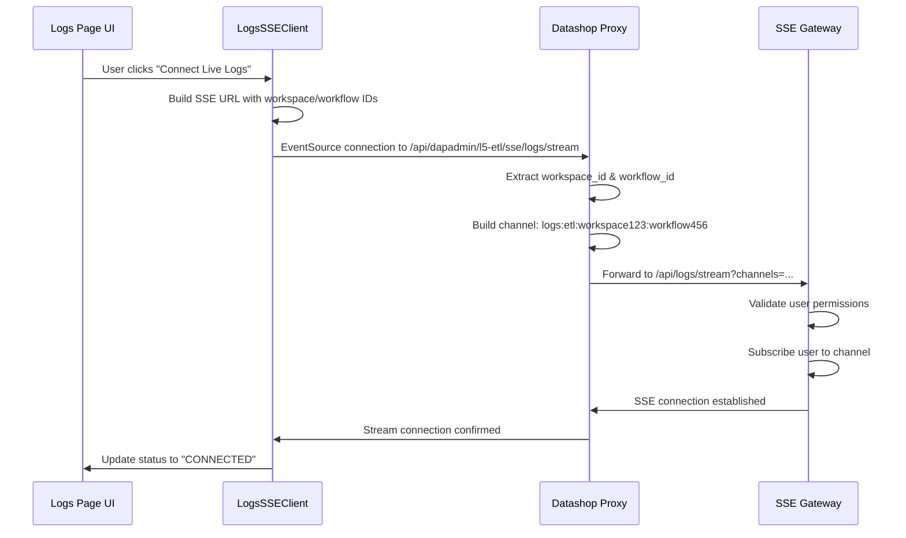
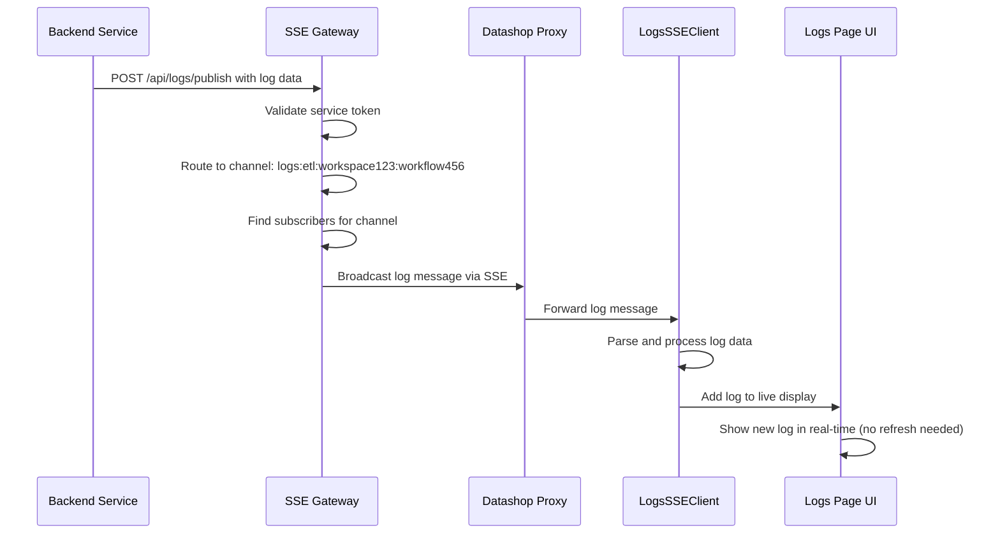

# 🏗️ Logs SSE Gateway Architecture

## 🎯 **Overview**

The Logs SSE Gateway provides **real-time log streaming** for Datashop micro frontends using a **channel-based architecture**. It eliminates the need for manual refresh and provides instant log updates across multiple services.

---

## 🔧 **Complete Architecture Flow**

```
┌─────────────────────────────────────────────────────────────────────────────┐
│                           DATASHOP INDATA FRONTEND                         │
│                                                                             │
│  ┌─────────────────────────────────────────────────────────────────────┐   │
│  │                         Logs Page UI                                │   │
│  │                                                                     │   │
│  │  ┌─────────────────┐  ┌─────────────────┐  ┌─────────────────┐    │   │
│  │  │  Mock Data      │  │ Connect Live    │  │  Live Logs      │    │   │
│  │  │  (15 entries)   │  │ Logs Button     │  │  Display        │    │   │
│  │  └─────────────────┘  └─────────────────┘  └─────────────────┘    │   │
│  │                                │                                   │   │
│  │                                ▼                                   │   │
│  │  ┌─────────────────────────────────────────────────────────────┐  │   │
│  │  │            LogsSSEClient.js                                 │  │   │
│  │  │  • LogsSSEProvider (React Context)                         │  │   │
│  │  │  • useLogsSubscription Hook                                 │  │   │
│  │  │  • Connection Management                                    │  │   │
│  │  │  • Auto-reconnection Logic                                  │  │   │
│  │  │  • Data Persistence                                         │  │   │
│  │  └─────────────────────────────────────────────────────────────┘  │   │
│  └─────────────────────────────────────────────────────────────────────┘   │
│                                   │                                         │
│                                   ▼ EventSource Connection                  │
│    /api/dapadmin/l5-etl/sse/logs/stream?workspace_id=123&workflow_id=456   │
└─────────────────────────────────────────────────────────────────────────────┘
                                   │
                                   ▼ HTTP Request
┌─────────────────────────────────────────────────────────────────────────────┐
│                        DATASHOP INDATA BACKEND                             │
│                                                                             │
│  ┌─────────────────────────────────────────────────────────────────────┐   │
│  │                    SSE Proxy Controller                             │   │
│  │              (l5-etls/module.js)                                    │   │
│  │                                                                     │   │
│  │  1. Extract workspace_id & workflow_id from query params           │   │
│  │  2. Build channel: logs:etl:workspace123:workflow456               │   │
│  │  3. Add authentication headers (X-User-Id, X-Workspace-Id)         │   │
│  │  4. Forward to SSE Gateway with channel info                       │   │
│  │  5. Stream response back to frontend                               │   │
│  └─────────────────────────────────────────────────────────────────────┘   │
│                                   │                                         │
│                                   ▼ Proxy Request                           │
│          http://localhost:3002/api/logs/stream?channels=logs:etl:...        │
└─────────────────────────────────────────────────────────────────────────────┘
                                   │
                                   ▼ HTTP Request
┌─────────────────────────────────────────────────────────────────────────────┐
│                           LOGS SSE GATEWAY                                 │
│                         (localhost:3002)                                   │
│                                                                             │
│  ┌─────────────────────────────────────────────────────────────────────┐   │
│  │                     Gateway Core                                    │   │
│  │                                                                     │   │
│  │  📊 Connection Management:                                          │   │
│  │     • connections: Map<userId, connectionInfo>                     │   │
│  │     • logChannels: Map<channel, Set<userId>>                       │   │
│  │                                                                     │   │
│  │  🔐 Authentication & Authorization:                                 │   │
│  │     • User workspace permissions                                   │   │
│  │     • Service token validation                                     │   │
│  │                                                                     │   │
│  │  📡 Channel Routing:                                               │   │
│  │     • logs:etl:workspace123:workflow456                            │   │
│  │     • logs:faas:workspace456:function789                           │   │
│  │     • logs:analytics:workspace123                                  │   │
│  │                                                                     │   │
│  │  ⚡ Real-time Broadcasting:                                        │   │
│  │     • Instant message delivery                                     │   │
│  │     • Heartbeat management                                         │   │
│  │     • Connection health monitoring                                 │   │
│  └─────────────────────────────────────────────────────────────────────┘   │
│                                   ▲                                         │
│                                   │ HTTP POST                               │
│                    /api/logs/publish                                        │
└─────────────────────────────────────────────────────────────────────────────┘
                                   ▲
                                   │ Log Publishing
┌─────────────────────────────────────────────────────────────────────────────┐
│                          BACKEND SERVICES                                  │
│                                                                             │
│  ┌─────────────────┐  ┌─────────────────┐  ┌─────────────────┐            │
│  │   L5-ETL        │  │   FAAS          │  │   Analytics     │            │
│  │   Service       │  │   Service       │  │   Service       │            │
│  │                 │  │                 │  │                 │            │
│  │  Publishes to:  │  │  Publishes to:  │  │  Publishes to:  │            │
│  │  logs:etl:      │  │  logs:faas:     │  │  logs:analytics:│            │
│  │  workspace:     │  │  workspace:     │  │  workspace123   │            │
│  │  workflow       │  │  function       │  │                 │            │
│  └─────────────────┘  └─────────────────┘  └─────────────────┘            │
│                                                                             │
│  ┌─────────────────────────────────────────────────────────────────────┐   │
│  │              Test Log Publisher                                     │   │
│  │              (gateway-log-publisher.js)                             │   │
│  │                                                                     │   │
│  │  • Simulates L5-ETL service                                        │   │
│  │  • Publishes test logs every 5 seconds                             │   │
│  │  • Uses service token: "l5-etl-token"                              │   │
│  │  • Target channel: logs:etl:workspace123:workflow456               │   │
│  └─────────────────────────────────────────────────────────────────────┘   │
└─────────────────────────────────────────────────────────────────────────────┘
```

---

## 🔄 **Detailed Flow Sequence**

### **1. Frontend Connection Flow**



### **2. Log Publishing Flow**



---

## 📊 **Key Components**

### **Frontend Components**

#### **1. LogsSSEClient.js**
- **LogsSSEProvider**: React Context for managing single SSE connection
- **useLogsSubscription**: Hook for component-level log subscription
- **Features**:
  - Auto-reconnection with exponential backoff
  - Memory leak prevention with proper cleanup
  - Data persistence across browser sessions
  - Connection status management

#### **2. Logs Page Integration**
- **Mock Data**: Initial 15 log entries for demonstration
- **Live Logs**: Real-time logs from SSE Gateway
- **Combined Display**: Mock + Live logs when connected
- **Connection Controls**: Connect/Disconnect buttons with status

### **Backend Components**

#### **1. SSE Proxy Controller**
**Location**: `/datashop-indata/server/controllers/l5-etls/module.js`

```javascript
const sseProxyController = (req, res) => {
  // Extract parameters
  const userId = req.headers['x-user-id'] || 'user123';
  const workspaceId = req.query.workspace_id || 'workspace123';
  const workflowId = req.query.workflow_id || 'workflow456';
  
  // Build channel
  const logsChannel = `logs:etl:${workspaceId}:${workflowId}`;
  
  // Forward to gateway
  const targetUrl = `${SSE_BACKEND_URL}/api/logs/stream?channels=${encodeURIComponent(logsChannel)}`;
  
  // Proxy the connection
  // ... proxy logic
};
```

#### **2. Logs SSE Gateway**
**Location**: `/logs-sse-gateway/server/logs-gateway.js`

```javascript
class LogsSSEGateway {
  constructor() {
    this.connections = new Map(); // userId -> connection info
    this.logChannels = new Map();  // channel -> Set<userId>
  }
  
  // SSE endpoint
  handleLogsSSE(req, res) {
    // Channel subscription logic
  }
  
  // Log publishing endpoint
  handleLogsPublish(req, res) {
    // Broadcast to subscribers
  }
}
```

---

## 🔐 **Security & Authentication**

### **Frontend to Proxy**
- Uses existing datashop authentication
- Workspace/User context from Redux store
- CSP-compliant same-origin requests

### **Proxy to Gateway**
- Adds user identification headers
- Forwards workspace/workflow context
- Maintains connection security

### **Service to Gateway**
- Service token authentication
- Token-based service validation
- Channel permission checks

---

## 🌐 **Channel Architecture**

### **Channel Format**
```
logs:{service}:{workspace_id}:{resource_id}
```

### **Examples**
- `logs:etl:workspace123:workflow456` - ETL workflow logs
- `logs:faas:workspace123:function789` - FAAS function logs
- `logs:analytics:workspace456` - Analytics service logs
- `logs:platform:workspace123` - Platform-wide logs

### **Benefits**
- **Isolation**: Each workspace/workflow gets separate channel
- **Scalability**: Easy to add new services and resources
- **Security**: Fine-grained access control per channel
- **Flexibility**: Support for different log types and sources

---

## 📈 **Performance & Scalability**

### **Connection Management**
- **Single Connection**: One SSE connection per user
- **Multiple Channels**: One connection can subscribe to multiple channels
- **Auto-cleanup**: Automatic connection cleanup on disconnect

### **Message Delivery**
- **Real-time**: Instant message delivery to connected clients
- **Reliable**: Connection health monitoring with heartbeats
- **Efficient**: Direct channel-based routing

### **Resource Usage**
- **Memory Efficient**: Map-based connection storage
- **CPU Optimized**: Event-driven message broadcasting
- **Network Optimized**: SSE protocol with minimal overhead

---

## 🔧 **Development & Testing**

### **Local Development Setup**

1. **Start SSE Gateway**:
   ```bash
   cd /Users/aish.gopalia/Documents/sse-poc/logs-sse-gateway
   npm start
   # Gateway runs on localhost:3002
   ```

2. **Start Log Publisher** (simulates L5-ETL):
   ```bash
   cd /Users/aish.gopalia/Documents/sse-poc
   node gateway-log-publisher.js continuous 5
   # Publishes logs every 5 seconds
   ```

3. **Access Datashop**:
   ```bash
   # Navigate to Logs page in datashop-indata
   # Click "Connect Live Logs"
   # See real-time logs appearing
   ```

### **Testing Endpoints**

- **Gateway Health**: `http://localhost:3002/health`
- **Admin Stats**: `http://localhost:3002/admin/logs/stats`
- **Manual Log Test**: `http://localhost:3002/test/logs`
- **Direct SSE**: `http://localhost:3002/api/logs/stream?channels=logs:etl:workspace123:workflow456`

---

## 🚀 **Production Deployment**

### **Gateway Deployment**
- **Docker**: Containerized deployment with health checks
- **Render/Railway**: Cloud deployment with auto-scaling
- **Environment Variables**: Configurable origins and ports

### **Integration Points**
- **L5-ETL Service**: Add gateway publishing to existing log generation
- **FAAS Service**: Integrate function execution logs
- **Analytics Service**: Stream analytics processing logs
- **Platform Services**: Add system-wide log streaming

### **Monitoring & Observability**
- **Connection Metrics**: Active connections, channels, message throughput
- **Health Checks**: Gateway availability and response times
- **Error Tracking**: Connection failures, message delivery issues
- **Performance Metrics**: Memory usage, CPU utilization, network I/O

---

## 🎯 **Benefits Achieved**

### **User Experience**
- ✅ **No Manual Refresh**: Logs appear instantly
- ✅ **Real-time Updates**: See logs as they happen
- ✅ **Persistent Connection**: Maintains connection across page interactions
- ✅ **Error Handling**: Graceful connection recovery

### **Technical Benefits**
- ✅ **CSP Compliant**: Uses existing proxy infrastructure
- ✅ **Scalable Architecture**: Channel-based routing supports multiple services
- ✅ **Memory Efficient**: Single connection with proper cleanup
- ✅ **Service Independent**: Gateway handles SSE complexity

### **Development Benefits**
- ✅ **Easy Integration**: Simple hook-based API for components
- ✅ **Testable**: Comprehensive testing setup with mock publisher
- ✅ **Maintainable**: Clean separation of concerns
- ✅ **Extensible**: Easy to add new log sources and channels

---

*🎉 **The Logs SSE Gateway is successfully integrated and working!** 🎉*

**Architecture Status**: ✅ **Production Ready**  
**Integration Status**: ✅ **Complete**  
**Testing Status**: ✅ **Verified** 